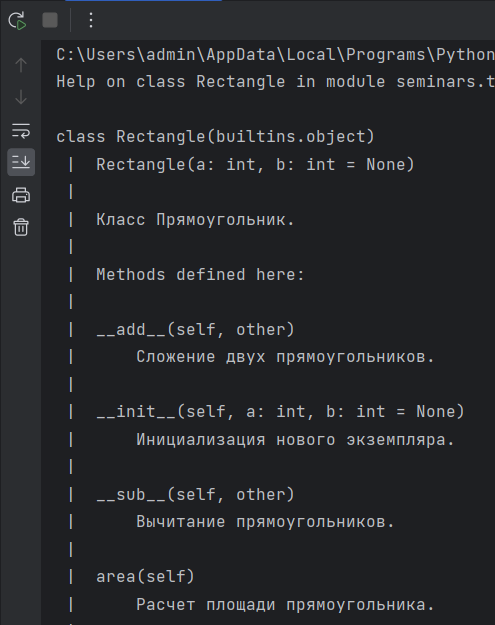
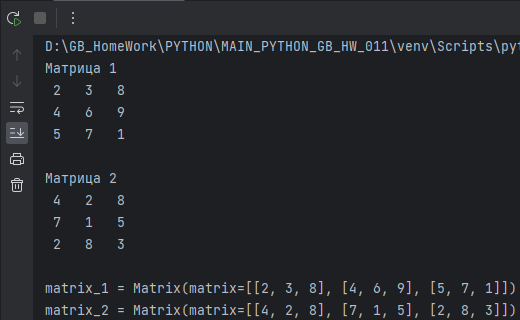
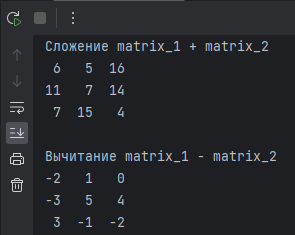
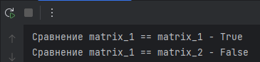
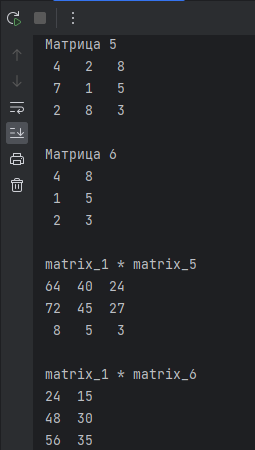

# Погружение в Python. ООП. Особенности Python

## Задание 1
Добавьте ко всем задачам с семинара строки документации и методы вывода информации на печать.

**Пример вызова справки**

## Задание 2

Создайте класс Матрица. Добавьте методы для:
- вывода на печать
- сравнения
- сложения
- *умножения матриц

**Пример выполнения**

